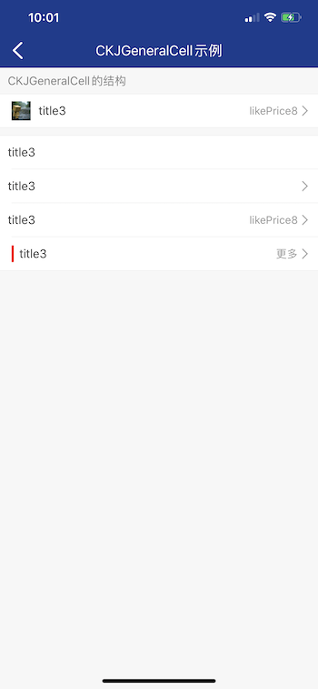
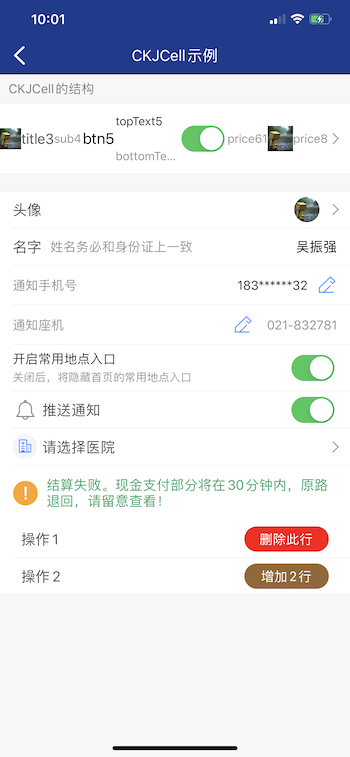
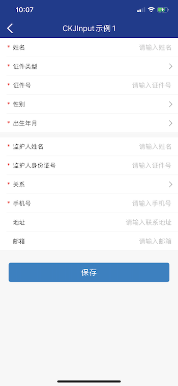
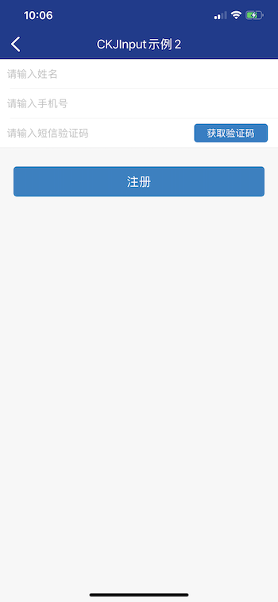
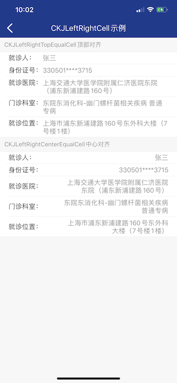
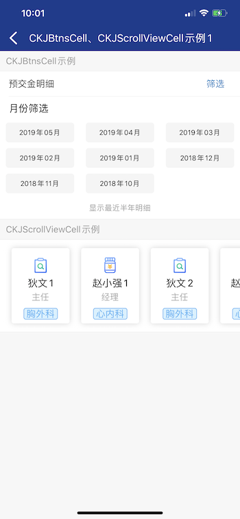
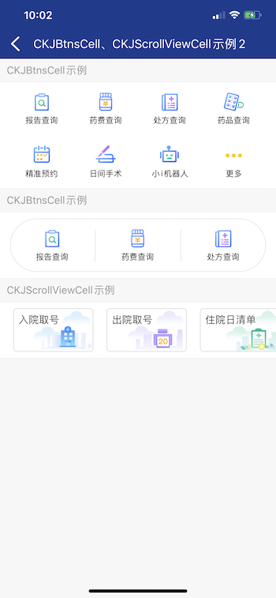
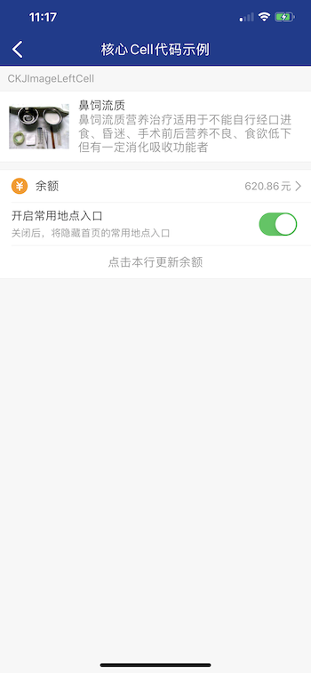
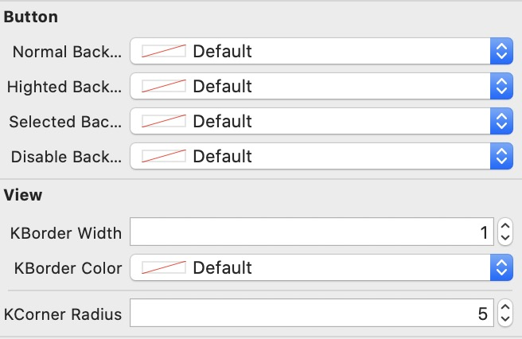

# KJSupportObjc

KJSupportObjc 是在iOS平台集常用分类、工具、异常处理、和自定义UITableView封装UITableView及常见的Cell套件为一体的一个常用轻量级的库，适用于所有iOS开发者，包括Objective-C和Swift

## 系统的UITableView有什么问题？
传统情况下，项目里很多控制器都会使用到UITableView，而且每个控制器要注册不同的Cell，实现

* registerNib:forCellReuseIdentifier:
* registerClass:forCellReuseIdentifier:
* numberOfSectionsInTableView:  
* tableView:numberOfRowsInSection:
* tableView:cellForRowAtIndexPath: 
* tableView:heightForRowAtIndexPath:
* tableView:heightForHeaderInSection:
* tableView:heightForFooterInSection:
* tableView:didSelectRowAtIndexPath:

几乎每一个用到UITableView的地方都要重复的写上面几行代码，这样传统的方式存在下面一些问题


* 每个用到UITableView的地方都要重复注册Cell和实现上面几行代码，以及维护数据源和UITableView匹配关系
* 对于UITableView里面有多重不同类型的Cell，处理Cell上显示的数据和Cell不等高，区头、区尾高度或者标题，稍有不慎，如果匹配不上，就会导致崩溃
* 我的界面和设置界面里常见的一些Cell（比如左边一个图片和标题、右边一个文字和箭头）在别的用到UITableView的地方又要重新写和注册等操作 
* 在一些控制器里，某些情况下需要隐藏若干个Cell，然后在另一种情况下又要显示这几个Cell，在传统的代码实现上，处理麻烦而且很难跨越项目统一处理
* 在一些时候需要对UITableView增加删除移动等操作，数据源处理不好，容易崩溃

```obj-c

@interface ViewController ()<UITableViewDataSource, UITableViewDelegate>

@property (strong, nonatomic) UITableView *tableView;

@property (strong, nonatomic) NSMutableDictionary *resourceDic;
@property (strong, nonatomic) NSDictionary *selectedScheduleDic;
@property (strong, nonatomic) NSMutableDictionary *statusDic;
@property (strong, nonatomic) NSMutableDictionary *scheduleDetailDic;

@end

@implementation ViewController

- (void)viewDidLoad {
    [super viewDidLoad];
    self.tableView = [[UITableView alloc] initWithFrame:[UIScreen mainScreen].bounds style:UITableViewStyleGrouped];
    self.tableView.dataSource = self;
    self.tableView.delegate = self;
    [self.view addSubview:self.tableView];
    
    [self.tableView registerNib:[UINib nibWithNibName:@"RJExpertPanbanTableViewCell" bundle:nil] forCellReuseIdentifier:@"RJExpertPanbanTableViewCell"];
    [self.tableView registerNib:[UINib nibWithNibName:@"RJIntroductionCell" bundle:nil] forCellReuseIdentifier:@"RJIntroductionCell"];
    [self.tableView registerNib:[UINib nibWithNibName:@"RJYuyueDateTableViewCell" bundle:nil] forCellReuseIdentifier:@"RJYuyueDateTableViewCell"];
    
    [self.tableView registerClass:[UITableViewCell class] forCellReuseIdentifier:@"UITableViewCell"];
    [self.tableView registerNib:[UINib nibWithNibName:@"RJScheduleCell" bundle:nil] forCellReuseIdentifier:@"RJScheduleCell"];
    
    [self.tableView registerNib:[UINib nibWithNibName:@"RJScheduleTitleCell" bundle:nil] forCellReuseIdentifier:@"RJScheduleTitleCell"];
    [self.tableView registerNib:[UINib nibWithNibName:@"RJDepartmentImageCell" bundle:nil] forCellReuseIdentifier:@"RJDepartmentImageCell"];
    
    [self.tableView registerNib:[UINib nibWithNibName:@"RJScheduleDetailTitleCell" bundle:nil] forCellReuseIdentifier:@"RJScheduleDetailTitleCell"];
    [self.tableView registerNib:[UINib nibWithNibName:@"RJScheduleDetailCell" bundle:nil] forCellReuseIdentifier:@"RJScheduleDetailCell"];
    
    self.tableView.rowHeight = UITableViewAutomaticDimension;
    self.tableView.estimatedRowHeight = 40;
}


#pragma mark - Table view data source

- (NSInteger)numberOfSectionsInTableView:(UITableView *)tableView {
    return (3 + [self.resourceDic[_currentDateStr] count]);
}

- (NSInteger)tableView:(UITableView *)tableView numberOfRowsInSection:(NSInteger)section {
    switch (section) {
        case 0:
            return 2;
            break;
        case 1:
            return _appointmentType != RJRegister  ? 2 : 1;
            break;
        case 2:
            return 1;
            break;
        default:
            if (_canShowDetail == true) {
               NSDictionary *scheduleDic = self.resourceDic[_currentDateStr][section - 3];
                NSString *planId = scheduleDic[@"PlanId"];
                if ([self.statusDic[planId] integerValue] == 1) {
                    return ( 2 + [self.scheduleDetailDic[planId] count]);
                }
            }
            return 1;
            break;
    }
}
- (CGFloat)tableView:(UITableView *)tableView heightForRowAtIndexPath:(NSIndexPath *)indexPath {
    if (indexPath.section == 0) {
        if (indexPath.row == 0) {
            return self.outpatientType > 1 ? 60 : 100;
        }else{
            return UITableViewAutomaticDimension;
        }
    }else if(indexPath.section == 1){
        if (indexPath.row == 0) {
            return 40;
        }else{
            return 60;
        }
    }else{
        return 44;
    }
}

- (UITableViewCell *)tableView:(UITableView *)tableView cellForRowAtIndexPath:(NSIndexPath *)indexPath {
    kWeakSelf(self);
    if (indexPath.section == 0) {
        if (indexPath.row == 0) {
            if (_outpatientType > 1) {
                RJExpertPanbanTableViewCell *cell = [tableView dequeueReusableCellWithIdentifier:@"RJExpertPanbanTableViewCell" forIndexPath:indexPath];
                cell.dataDic = _dataDic;
                return cell;
            }else{
                RJDepartmentImageCell *cell = [tableView dequeueReusableCellWithIdentifier:@"RJDepartmentImageCell" forIndexPath:indexPath];
                cell.text = _deptModel.HisDeptName;
                return cell;
            }
        }else{
            RJIntroductionCell *cell = [tableView dequeueReusableCellWithIdentifier:@"RJIntroductionCell" forIndexPath:indexPath];
            cell.text = _outpatientType > 1 ? _dataDic[@"Profession"] : _deptModel.Description;
            return cell;
        }
        
    }else if(indexPath.section == 1){
        if(indexPath.row){
            RJYuyueDateTableViewCell *cell = [tableView dequeueReusableCellWithIdentifier:@"RJYuyueDateTableViewCell" forIndexPath:indexPath];
            cell.appointmentDateArray = self.appointmentDateArray;
            cell.currentDateStr = self.currentDateStr;
            return cell;
        }else{
            UITableViewCell *cell = [tableView dequeueReusableCellWithIdentifier:@"UITableViewCell" forIndexPath:indexPath];
            cell.textLabel.font = [UIFont systemFontOfSize:15.0f];
            NSString *dateText = [NSString stringWithFormat:@"%@  %@",_currentDateStr ? _currentDateStr : @"",_currentWeekStr ? _currentWeekStr : @""];
            cell.textLabel.text = dateText;
            cell.selectionStyle = UITableViewCellSelectionStyleNone;
            return cell;
        }
    }else if(indexPath.section == 2){
        RJScheduleTitleCell *cell = [tableView dequeueReusableCellWithIdentifier:@"RJScheduleTitleCell" forIndexPath:indexPath];
        return cell;
    }else{
        NSDictionary *scheduleDic = self.resourceDic[_currentDateStr][indexPath.section - 3];
        NSString *planId = scheduleDic[@"PlanId"];
        
        if (indexPath.row == 0) {
            RJScheduleCell *cell = [tableView dequeueReusableCellWithIdentifier:@"RJScheduleCell" forIndexPath:indexPath];
            cell.canShowDetail = self.canShowDetail;
            return cell;
        }else if(indexPath.row == 1){
            RJScheduleDetailTitleCell *cell = [tableView dequeueReusableCellWithIdentifier:@"RJScheduleDetailTitleCell" forIndexPath:indexPath];
            return cell;
        }else{
            RJScheduleDetailCell *cell = [tableView dequeueReusableCellWithIdentifier:@"RJScheduleDetailCell" forIndexPath:indexPath];
            cell.dataDic = self.scheduleDetailDic[planId][indexPath.row - 2];
            return cell;
        }
    }
}

@end

```
上面这样一个示例，你会清晰的发现，当一个UITableView里面有多种类型的情况时，这代码已经变得难以阅读你也很难很好的掌握这几个协议方法之间匹配关系了，上面的示例仅仅是在一个UITableView里面，往往公司的项目都很庞大，使用UITableView地方特别多，使用传统的方式不仅仅要写很多重复的代码，枯燥无味，而且项目也很难维护，下面是CKJSimpleTableView解决这样的问题的方式。

## 准备与CKJSimpleTableView见面
这是CKJSimpleTableView的写法

```obj-c
- (nonnull NSDictionary <NSString *, NSDictionary <NSString *, id>*> *)returnCell_Model_keyValues:(CKJSimpleTableView *_Nonnull)s {
    return @{
             NSStringFromClass([RJDepartmentImageCellModel class]) : @{cellKEY : NSStringFromClass([RJDepartmentImageCell class]), isRegisterNibKEY : @YES},
             NSStringFromClass([RJSchedule_DoctorCellModel class]) : @{cellKEY : NSStringFromClass([RJSchedule_DoctorCell class]), isRegisterNibKEY : @YES},
             NSStringFromClass([RJSchedule_IntroductionCellModel class]) : @{cellKEY : NSStringFromClass([RJSchedule_IntroductionCell class]), isRegisterNibKEY : @YES},
             NSStringFromClass([RJSchedule_DateCellModel class]) : @{cellKEY : NSStringFromClass([RJSchedule_DateCell class]), isRegisterNibKEY : @YES},
             NSStringFromClass([RJSchedule_DetailTitleCellModel class]) : @{cellKEY : NSStringFromClass([RJSchedule_DetailTitleCell class]), isRegisterNibKEY : @NO}
             };
}

- (void)initSimpleTableViewData {
    KJ_typeweakself
    CKJCommonSectionModel *section1 = [CKJCommonSectionModel sectionWithDetailSetting:^(__kindof CKJCommonSectionModel * _Nonnull _sec) {
        RJSchedule_DoctorCellModel *model1 = [RJSchedule_DoctorCellModel modelWithCellHeight:70 cellModel_id:nil detailSettingBlock:^(RJSchedule_DoctorCellModel * _Nonnull m) {
            m.doctModel = _doctModel;
        } didSelectRowBlock:nil];
        RJDepartmentImageCellModel *model2 = [RJDepartmentImageCellModel modelWithCellHeight:120 cellModel_id:nil detailSettingBlock:^(__kindof RJDepartmentImageCellModel * _Nonnull m) {
            m.dep = _deptModel.HisDeptName;
        } didSelectRowBlock:nil];
        RJSchedule_IntroductionCellModel *model3 = [RJSchedule_IntroductionCellModel modelWithCellHeight:0 cellModel_id:nil detailSettingBlock:^(__kindof RJSchedule_IntroductionCellModel * _Nonnull m) {
            m.text = self.category.type > 1 ? _doctModel.Profession : _deptModel.Description;
        } didSelectRowBlock:nil];
        _sec.modelArray = @[model1, model2, model3];
    }];
    
    CKJCommonSectionModel *section2 = [CKJCommonSectionModel sectionWithHeaderHeight:10 detailSetting:^(__kindof CKJCommonSectionModel * _Nonnull _sec) {
        RJSchedule_DetailTitleCellModel *model1 = [RJSchedule_DetailTitleCellModel modelWithCellHeight:40 cellModel_id:nil detailSettingBlock:nil didSelectRowBlock:nil];
        RJSchedule_DateCellModel *model2 = [RJSchedule_DateCellModel modelWithCellHeight:60 cellModel_id:@(kCollectionDateCell) detailSettingBlock:^(__kindof RJSchedule_DateCellModel * __weak _Nonnull m) {
            m.selectedDateBlock = ^(NSInteger index, NSString *dateStr, NSString *weekStr) {
                NSLog(@"点击 某一天");
            };
        } didSelectRowBlock:nil];
        _sec.modelArray = @[model1, model2];
    }];
    self.simpleTableView.dataArr = @[section1, section2];
}
```
你可以只需要创建`CKJCommonSectionModel`分区对象和`CKJCommonCellModel`每一行CellModel的子对象，用CKJSimpleTableViewDataSource、CKJSimpleTableViewDelegate代替系统的UITableViewDataSource、UITableViewDelegate方法，此刻你只需要管理数据即可，`不需要担心CKJSimpleTableView数据匹配不上导致的闪退问题`

## CKJCommonSectionModel、CKJCommonCellModel


### CKJCommonSectionModel
你会发现现在设置区头区尾高度和标题会变得非常方便

```
// 区头高度10   区尾高度5
    CKJCommonSectionModel *section1 = [CKJCommonSectionModel sectionWithHeaderHeight:10 footerHeight:20 detailSetting:nil];
    // 区头标题
    CKJCommonSectionModel *section2 = [CKJCommonSectionModel sectionWithHeaderAttString:WDCKJAttributed2(@"区头标题", [UIColor grayColor], @15) detailSetting:nil];

```
### CKJCommonCellModel
自适应高度 和 固定高度

```
    // Cell高度 50
    CKJCommonCellModel *cellModel1 = [CKJCommonCellModel modelWithCellHeight:50 cellModel_id:nil detailSettingBlock:nil didSelectRowBlock:nil];
    // Cell高度 自适应
    CKJCommonCellModel *cellModel2 = [CKJCommonCellModel modelWithCellHeight:0 cellModel_id:nil detailSettingBlock:nil didSelectRowBlock:nil];

```

隐藏和显示某一行

```
    CKJCommonCellModel *cellModel1 = [CKJCommonCellModel modelWithCellHeight:50 cellModel_id:@(234) detailSettingBlock:nil didSelectRowBlock:nil];
    cellModel1.displayInTableView = NO; // 隐藏Cell
    
    [self.simpleTableView kjwd_filterCellModelForID:234 finishBlock:^(__kindof CKJCommonCellModel * _Nonnull m) {
        m.displayInTableView = YES;  // 显示Cell
        [self.simpleTableView reloadData];
    }];
```

还可以设置每一行的背景颜色cell_bgColor、选择效果selectionStyle、是否显示分割线showLine，这些操作都变得非常简单

## 删除和插入相关操作

### 插入
在指定Cell的后面插入Cells数组（可使用动画）

* kjwd_insertCellModelsInAllCellModel:afterCellModel:
* kjwd_insertCellModelsInAllCellModel:afterCellModel:withRowAnimation:animationBlock:

在指定分区的末尾拼接Cells数组（可使用动画）

* appendCellModelArray:atLastRow_InAllCellModelArrayOfSection:
* appendCellModelArray:atLastRow_InAllCellModelArrayOfSection:withRowAnimation:animationBlock:


```
    // 示例1
    [self.simpleTableView kjwd_insertCellModelInAllCellModel:@[age_cellModel, idCardNumber_cellModel] afterCellModel:@[age_cellModel] withRowAnimation:UITableViewRowAnimationRight animationBlock:^(void (^ _Nonnull animationBlock)(void)) {
        animationBlock(); // 使用动画插入，执行动画
    }];
    
    // 示例2
    [self.simpleTableView appendCellModelArray:@[name_cellModel, idCardNumber_cellModel, relate_cellModel, phone_cellModel, address_cellModel, email_cellModel] atLastRow_InAllCellModelArrayOfSection:1];
    [self.simpleTableView kjwd_reloadSection:1 withRowAnimation:UITableViewRowAnimationRight];

```

### 删除

删除模型在某个分区的某一行（可使用动画）

* removeCellModelAtSection:rows:removeHiddenCellModel:
* removeCellModelAtSection:rows:removeHiddenCellModel:withRowAnimation:animationBlock:

删除模型在某个分区除了指定行的全有行，只保留指定行（可使用动画）

* removeAllCellModelAtSection:keepDisplayRows:removeHiddenCellModel:
* removeAllCellModelAtSection:keepDisplayRows:removeHiddenCellModel:withRowAnimation:animationBlock:

删除某个分区（可使用动画）

* removeSections:
* removeSections:withRowAnimation:animationBlock:

删除全部分区，只保留指定分区（可使用动画）

* removeAllSection_notIncludedSection:
* removeAllSection_notIncludedSection:withRowAnimation:animationBlock:

```
和插入一样的写法
```

## 核心Cell

CKJSimpleTableView套件提供了最常用的一些Cell，满足大部分功能需求，极大节省了开发时长


类名           |  简介
-------------------------  |  --------------------------
CKJGeneralCell              |  左边一个图片和标题，右边一个文字和图片(箭头)，一般用于我的和设置界面 
CKJCell             |  继承于CKJGeneralCell，主要多了上下UILabel，和开关按钮
CKJInputCell             |  继承于CKJCell，多了输入框
CKJTableViewCell1、CKJTableViewCell2             |  只有UILabel
CKJLeftRightCenterEqualCell、CKJLeftRightTopEqualCell             |  左边一个UILabel，右边一个文本类型的Cell，`需要设置配置信息`
CKJImageLeftCell             |  图片在左边，右边上下最多5个UILabel，`需要设置配置信息`
CKJImageRightCell             |  左边上下最多5个UILabel，图片在右边，`需要设置配置信息`
CKJPayCell             |  继承于CKJImageLeftCell，常用于选择支付方式
CKJBtnsCell1、CKJBtnsCell2             |  常用于三到九宫格布局，`需要设置配置信息`
CKJScrollViewCell             |  单行可以滚动的多个ItemView，类似相册一样，`需要设置配置信息`
CKJLikeQRCell             |  单个二维码图片，`需要设置配置信息`

类名           |  简介
-------------------------  |  --------------------------
              |  
              |  
              |  
              |  

请看下面代码

```

#import "DemoCoreCellVC.h"

@interface DemoCoreCellVC ()

@end

@implementation DemoCoreCellVC

#define kPriceCellID 321

- (void)viewDidLoad {
    [super viewDidLoad];
    self.navigationItem.title = @"核心Cell代码示例";
    [self installComplementData];
}

#pragma mark - CKJSimpleTableView 数据源 和 代理
- (nonnull NSDictionary <NSString *, NSDictionary <NSString *, id>*> *)returnCell_Model_keyValues:(CKJSimpleTableView *_Nonnull)s {
    
    CKJImageLeftCellConfig *leftConfig = [CKJImageLeftCellConfig configWithDetailSettingBlock:^(__kindof CKJImageLeftCellConfig * _Nonnull m) {
        m.imageSize = CGSizeMake(80, 80);
        m.fiveConfig = [CKJFiveLabelViewConfig configWithDetailSettingBlock:^(__kindof CKJFiveLabelViewConfig * _Nonnull m) {
            m.subTitle_numberOfLines = 3;
        }];
    }];
    
    return @{
        NSStringFromClass([CKJImageLeftCellModel class]) : @{cellKEY : NSStringFromClass([CKJImageLeftCell class]), isRegisterNibKEY : @NO, configDicKEY_ConfigModel : leftConfig},
    };
}

- (void)installComplementData {
    
    CKJCommonSectionModel *section1 = [CKJCommonSectionModel sectionWithHeaderAttString:WDCKJAttributed2(@"CKJImageLeftCell", [UIColor kjwd_subTitleColor969696], @14) headerAlignment:NSTextAlignmentLeft detailSetting:^(__kindof CKJCommonSectionModel * _Nonnull _sec) {
        CKJImageLeftCellModel *model1 = [CKJImageLeftCellModel modelWithCellHeight:0 cellModel_id:nil detailSettingBlock:^(__kindof CKJImageLeftCellModel * _Nonnull m) {
            m.b_Image_URL = @"http://image.cmsfg.com/Images/20180608/2018060812432648.jpg";
            m.b_placeholderImage = [UIImage kjwd_imageNamed:@"占位图片.png"];
            [m updateFiveData:^(CKJFiveLabelModel * _Nonnull fm) {
               fm.title = WDCKJAttributed2(@"鼻饲流质", [UIColor kjwd_titleColor333333], nil);
                fm.subTitle = WDCKJAttributed2(@"鼻饲流质营养治疗适用于不能自行经口进食、昏迷、手术前后营养不良、食欲低下但有一定消化吸收功能者", [UIColor kjwd_subTitleColor969696], nil);
            }];
        } didSelectRowBlock:nil];
        _sec.modelArray = @[model1];
    }];
    
    CKJCommonSectionModel *section2 = [CKJCommonSectionModel sectionWithHeaderHeight:10 detailSetting:^(__kindof CKJCommonSectionModel * _Nonnull _sec) {
        CKJGeneralCellModel *model1 = [CKJGeneralCellModel modelWithCellHeight:44 cellModel_id:@(kPriceCellID) detailSettingBlock:^(__kindof CKJGeneralCellModel * _Nonnull m) {
            m.image2Model = [CKJImage2Model image2ModelWithImageString:@"demo余额.png" size:CGSizeMake(22, 22) left:15];
            m.title3Model = [CKJTitle3Model title3ModelWithAttributedText:WDCKJAttributed2(@"余额", [UIColor kjwd_titleColor333333], nil) left:10];
            m.likePrice8Model = [CKJLikePriceLabel8Model likePriceLabel8ModelWithAttText:WDCKJAttributed2(@"620.86元", [UIColor kjwd_subTitleColor969696], @14) left:0 right:0];
            m.arrow9Model = [CKJArrow9Model arrow9SystemModel];
        } didSelectRowBlock:^(__kindof CKJGeneralCellModel *__weak  _Nonnull m) {
           NSLog(@"点击了当前行");
        }];
        
        
        CKJCellModel *model2 = [CKJCellModel modelWithCellHeight:0 cellModel_id:nil detailSettingBlock:^(__kindof CKJCellModel * _Nonnull m) {
            m.view5Model = [CKJView5Model view5ModelWithTopAttributedText:WDCKJAttributed2(@"开启常用地点入口", [UIColor kjwd_titleColor333333], @15) bottomAttributedText:WDCKJAttributed2(@"关闭后，将隐藏首页的常用地点入口", [UIColor kjwd_subTitleColor969696], @13) centerMarign:5 topBottomMargin:8 leftMargin:15 rightMargin:0];
            m.switch6Model = [CKJSwitch6Model switch6ModelWithSwitchOn:YES left:0 top:0 bottom:0 callBack:^(BOOL switchOn, CKJCellModel *cellModel, UISwitch *senderSwitch) {
                NSLog(@"检测到 开关按钮切换，此时状态是 %@ %@", cellModel.view5Model.topText.string, switchOn ? @"开启" : @"关闭");
            }];
            m.likePrice61Model = [CKJLikePriceLabel61Model likePriceModelWithLeftMargin:15];
        } didSelectRowBlock:nil];
        
        CKJTableViewCell1Model *model3 = [CKJTableViewCell1Model modelWithCellHeight:44 cellModel_id:nil detailSettingBlock:^(__kindof CKJTableViewCell1Model * _Nonnull m) {
            m.textLabelAttStr = WDCKJAttributed2(@"点击本行更新余额", [UIColor kjwd_subTitleColor969696], nil);
            m.textAlignment = NSTextAlignmentCenter;
        } didSelectRowBlock:^(__kindof CKJTableViewCell1Model * _Nonnull m) {
            [m.cell.simpleTableView kjwd_filterCellModelForID:kPriceCellID finishBlock:^(CKJGeneralCellModel * _Nonnull m) {
                NSString *arc1 = [NSString kjwd_returnArc4randomWithNum:3 type:KJWDArc4randomType_Number];
                NSString *point = [NSString kjwd_returnArc4randomWithNum:2 type:KJWDArc4randomType_Number];
                [m.likePrice8Model changeText:[NSString stringWithFormat:@"%@.%@元", arc1, point]];
            }];
            [m.cell.simpleTableView kjwd_reloadData];
        }];
        _sec.modelArray = @[model1, model2, model3];
    }];
    self.simpleTableView.dataArr = @[section1, section2];
}

@end


```
效果如下



开发者只需管理好数据模型，UI全部根据数据模型进行渲染，如果想要修改UI的数据，只需要找到其数据模型，修改数据模型的数据，UI会自动改变。有些核心Cell需要设置配置数据，有些可以直接进行使用。比如上面示例中， CKJImageLeftCell则需要设置配置数据，而CKJGeneralCell和CKJCell则不需要。

对于封装好的核心Cell，省去了开发者在不同的界面里重复的布局Cell带来的麻烦，可以提高开发效率节约开发时间。


## 常用分类
KJSupportObjc库提供了iOS最常用的分类，包括NSArray、NSMutableArray、NSDictionary、NSString、NSDate、UIView、UIButton、UIColor、UIImage、UIViewController等。

KJSupportObjc库对系统的类做了很多异常处理，在异常的情况下给出友好的提示。

异常处理、友好提示

```
@implementation NSString (WDYHFCategory)

- (nullable NSString *)kjwd_substringWithRange:(NSRange)range {
    NSUInteger location = range.location;
    NSUInteger length = range.length;
    if (location > self.length || location < 0 || length > self.length || length < 0) {
        NSLog(@"%s ---> range的location 或 length 不符合规范 %@,  字符串(%@)长度是%lu", __func__, NSStringFromRange(range), self, (unsigned long)self.length);
        return nil;
    }
    if (location + length > self.length) {
        NSLog(@"%s ---> %@ 越界,  字符串(%@)长度是%lu", __func__, NSStringFromRange(range), self, (unsigned long)self.length);
        return nil;
    }
    return [self substringWithRange:range];
}

@end


@implementation NSMutableArray (WDYHFCategory)

- (BOOL)kjwd_insertObjects:(nullable NSArray *)objects atIndex:(NSUInteger)index {
    if (WDKJ_IsNull_Array(objects)) {
        NSLog(@"kjwd_insertObjects 对象不能被插入 因为对象为空");
        return NO;
    }
    if (index < 0) {
        NSLog(@"kjwd_insertObjects 不能插入在小于0的位置 , 当前数组个数是 %lu", (unsigned long)self.count);
        return NO;
    }
    
    if (index == self.count) {
        [self addObjectsFromArray:objects];
        return YES;
    } else if (index > self.count) {
        NSLog(@"kjwd_insertObjects 位置 %lu 越界, 当前数组个数是 %lu", (unsigned long)index, (unsigned long)self.count);
        return NO;
    } else {
        NSRange range = NSMakeRange(index, [objects count]);
        NSIndexSet *indexSet = [NSIndexSet indexSetWithIndexesInRange:range];
        
        [self insertObjects:objects atIndexes:indexSet];
        return YES;
    }
}

@end

```

实用功能

```

@interface UIView (WDYHFCategory)

// View从底部向上出现的动画效果
- (void)masonryWithAnimateFromScreenButtomWithDuration:(NSTimeInterval)duration superView:(UIView *_Nullable)superView selfMasonryHeight:(CGFloat)height coverViewColor:(UIColor *_Nullable)coverViewColor animationCompletion:(void (^_Nullable)(BOOL))completionBlock triggerTapGestureRecognizerBlock:(void(^)(void(^_disappearBlock)(void)))triggerTapGestureRecognizerBlock;

// 点击灰色蒙版消失，需要开发者主动调用（View从底部向上出现的动画效果是配合使用）
- (void)masonryWithAnimateFromScreenButtom_hiddenBackGroundView;
- 
@end

```


### 分类实例方法


#### 异常处理
```
BOOL WDKJ_IsEmpty_Str(NSString *_Nullable str);
BOOL WDKJ_IsEmpty_AttributedStr(NSAttributedString *_Nullable attStr);
BOOL WDKJ_IsNull_Num(NSNumber *_Nullable number);
BOOL WDKJ_IsNull_Array(NSArray *_Nullable array);
NSString *WDKJ_SpaceString(NSString *_Nullable str);
NSString *WDKJ_ConfirmString(NSString *_Nullable str);
NSNumber *WDKJ_ConfirmNumber(NSNumber *_Nullable number);
```

#### NSArray和NSMutableArray


根据一个过滤条件，返回符合条件的元素

*  ``` - (nullable ObjectType)kjwd_do_filter_returnConformObject:(BOOL (^)(ObjectType objc))filterBlock; ```

根据一个过滤条件，返回符合条件的元素下标（如果没有符合的，就返回nil）

* ``` - (nullable NSNumber *)kjwd_do_filter_returnConformIndex:(BOOL (^)(ObjectType objc))filterBlock; ```

删除指定下标数组的元素

*  ``` - (void)kjwd_removeAllObjects_IncludedRows:(NSArray <NSNumber *>*)includedRows; ```

插入元素

* ``` - (BOOL)kjwd_insertObjects:(nullable NSArray<ObjectType> *)objects atIndex:(NSUInteger)index; ```

#### NSString

字符串验证

* ``` - (BOOL)kjwd_validatePhone; ```
* ``` - (BOOL)kjwd_validateIdentityCard; ```

随机数生成

* ``` + (NSString *)kjwd_returnArc4randomWithNum:(NSUInteger)num type:(KJWDArc4randomType)type; ```

字符串操作

*  ``` - (nullable NSString *)kjwd_substringFromIndex:(NSUInteger)from; ```
*  ``` - (nullable NSString *)kjwd_substringToIndex:(NSUInteger)to; ```
*  ``` - (nullable NSString *)kjwd_substringWithRange:(NSRange)range; ```


#### UIView

返回当前视图的控制器

*  ``` - (nullable __kindof UIViewController *)kjwd_currentViewController; ```

View从底部向上出现的动画效果

* ``` - (void)masonryWithAnimateFromScreenButtomWithDuration:(NSTimeInterval)duration superView:(UIView *_Nullable)superView selfMasonryHeight:(CGFloat)height coverViewColor:(UIColor *_Nullable)coverViewColor animationCompletion:(void (^_Nullable)(BOOL))completionBlock triggerTapGestureRecognizerBlock:(void(^)(void(^_disappearBlock)(void)))triggerTapGestureRecognizerBlock; ```


#### UIButton

调整图片和文字排布方式

*  ``` - (void)kjwd_layoutButtonWithEdgeInsetsStyle:(GLButtonEdgeInsetsStyle)style
imageTitleSpace:(CGFloat)space; ```

最常用的 点击按钮 回调

* ``` - (void)kjwd_addTouchUpInsideForCallBack:(void(^_Nullable)(UIButton * _sender))callBack; ```

#### 其他分类

#### NSURL
解决 有中文 会导致转换失败的问题, 场景1：设置UIImage时使用

* ``` + (NSURL *)kjwd_URLWithString:(nullable NSString *)urlString; ```

#### UIWindow

* ``` + (UIWindow *)kjwd_appdelegateWindow; ```


## 可设计IBInspectable
封装了UIView和UIButton直接在xib、storyboard里面直接拖线使用的IBInspectable，设置代码也可以使用

```
IB_DESIGNABLE
@interface UIView (CKJDesingable)

/** 边框宽度 */
@property (assign, nonatomic) IBInspectable CGFloat kBorderWidth;
/** 边框颜色 */
@property (strong, nonatomic) IBInspectable UIColor *kBorderColor;
/** 圆角*/
@property (assign, nonatomic) IBInspectable CGFloat kCornerRadius;

@end


IB_DESIGNABLE
@interface UIButton (CKJDesingable)

/** 背景色(正常) */
@property (strong, nonatomic) IBInspectable UIColor *normalBackgroundColor;
/** 高亮 */
@property (strong, nonatomic) IBInspectable UIColor *hightedBackgroundColor;
/** 背景色(选中) */
@property (strong, nonatomic) IBInspectable UIColor *selectedBackgroundColor;
/** 不可用 */
@property (strong, nonatomic) IBInspectable  UIColor *disableBackgroundColor;

@end

```



## 常用工具

类名           |  简介
-------------------------  |  --------------------------
CKJRSA              |  RSA加密
FileManagerTool             |  本地文件管理类
CKJToolPickerView	|	普通选择器视图
CKJDatePickerView	|	日期选择器视图


